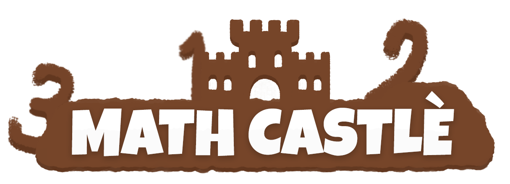

<h1 align="center">
    
</h1>

<h4 align="center">A tower defence mathematics learning game.</h4>

<p align="center">
  <a href="#about">About</a> •
  <a href="#what-we-learned-from-this-project">What We Learned From This Project</a> •
  <a href="#key-features">Key Features</a> •
  <a href="#how-to-use">How To Use</a> •
  <a href="#the-team">The Team</a>
  
</p>

<div align="center">
    
</div>

## About

This game was created for the [TOP Jam 1- Edutainment](https://itch.io/jam/top-jam-1), which was a game jam hosted by The Odin Project, where teams of a maximum of 4 had to create a game with the theme of education and entertainment. Each team had around a month to complete the game. The game had to be DOM only (no HTML canvas) and use tech taught by or closely related to The Odin Project, so no game frameworks like Unity or Phaser.js were allowed. At the end of the game jam, each game was scored on different criteria by a group of judges.

There was a forum given to everyone who wanted to participate, so that we could assemble a team together. We formed our team and decided to create a discord so that we could communicate with each other. In the lead up to the start date of the game jam, we setup a trello board so that we could assign each other tickets, helping us to stay organised. Throughout the process, we made sure to keep communicating with each other, which was hard at times due to the different time zones, but we overcame that by agreeing on a set time when we could all meet up on Discord to chat. It was a hard process for all of us, but we made sure to keep at it, to plan well, and help each other along the way. In the end, we achieved 4th place in the categories #fun, #theme, #educational value and 5th place of in #overall; which we are all very proud of.


For the tech side of things, we used a fixed time step engine approach that utilised the window.requestAnimationFrame function. This allowed us to call update and render functions at a consistent 60 times per second. The update functions would update all values related to the game objects, such as the enemy positions, and the render functions would translate this information into the CSS to create the animations.

## What We Learned From This Project

* Using pull requests to peer review code
* Git branch workflow
* Working with people in different time zones
* Using Trello to organise a project and work with Agile (Kanban for this case) Methodology
* Some of the team members weren't active for personal reasons, so we had to compensate for this by being effcient with our time
* Setting up team meetings on discord
* Using ESLint and Prettier for keeping the team's code style consistent using best practises
* ES6 Modules (Reusable code blocks); code separation for maintainability and readability
* Webpack for bundling our code
* Github actions for continuous deployment

## Key Features

* **Math question generator** - creates a math question based on selected difficulty
* **Difficulty selection** - decides the math operators and max numbers used for questions
* **Animated sprites** - enemy sprites with walking animation
* **Question history** - shows all questions asked, and the last 5 answers to those questions by the player
* **Score system** - receive points when a question is answered correctly and lose points when a wrong answer is given or when the castle is hit by a enemy

## How to use

To clone this repository, you will need [Git](https://git-scm.com/) and [Node.js](https://nodejs.org/en/download/) (which comes with [npm](http://npmjs.com)).

```bash
# Clone this repository
git clone https://github.com/kapaha/math-castle.git

# Go into the repository directory
cd math-castle

# Install dependencies
npm install

# Run in development mode
npm start
```

## The Team
<table>
    <tr>
        <td align="center">
            <a href="https://github.com/kapaha">
                
                <br />
                <sub>
                    <b>Kai Paterson-Hall</b>
                </sub>
            </a>
            <br />
        </td>
        <td align="center">
            <a href="https://github.com/tanselbay1">
                
                <br />
                <sub>
                    <b>Tansel Bayraktaroglu</b>
                </sub>
            </a>
            <br />
        </td>
        <td align="center">
            <a href="https://github.com/dwarjie">
                
                <br />
                <sub>
                    <b>Mark</b>
                </sub>
            </a>
            <br />
        </td>
        <td align="center">
            <a href="https://github.com/Ocoldwell">
                
                <br />
                <sub>
                    <b>Ollie Coldwell</b>
                </sub>
            </a>
            <br />
        </td>
    </tr>
</table>
